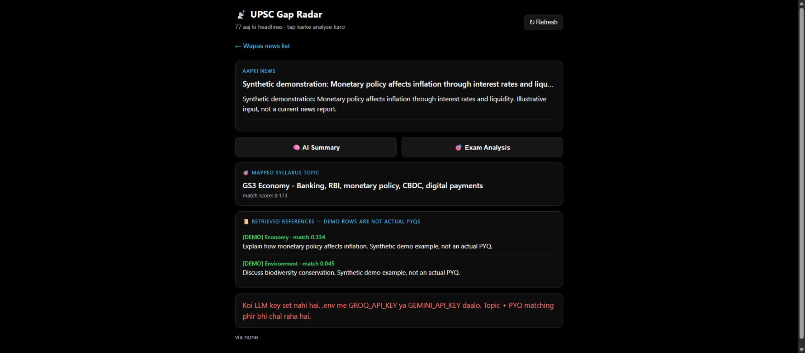

# UPSC Gap Radar — Current Affairs Retrieval POC

Connect a current-affairs article to syllabus topics and relevant revision examples.

**Built by Himanshu Chauhan** · [GitHub](https://github.com/himanshuc2406) · Contact: himanshuc2406@gmail.com

## Project walkthrough




## What the code implements

- Match article text to syllabus topics and reference questions with offline TF-IDF retrieval.
- Build a structured study-card prompt containing key points, organizations, a Prelims MCQ and a Mains question.
- Fetch news through RSS feeds with caching and graceful source failure handling.
- Retain topic/reference matching when no LLM key is available.

## Technical stack

Python · Flask · Pandas · scikit-learn TF-IDF · cosine similarity · RSS · Groq/Gemini

## Run locally

```bash
python -m venv .venv
# Activate .venv for your operating system.
pip install -r requirements.txt
python app.py
```

Open **http://127.0.0.1:5000**. Never commit your `.env`, API keys, OAuth credentials or runtime databases. Blank configuration examples are provided where needed.

## Verification

Local UI and offline analysis were exercised with explicitly synthetic monetary-policy input; topic and demo references returned correctly without an LLM key. API-generated study cards are not verified.

## Scope and limitations

The included reference rows are synthetic examples labeled DEMO, not authenticated previous-year questions. Relevance is lexical, not evidence that a question appeared in a particular year. This is a local proof of concept.

## Repository structure

- `.env.example`
- `.gitignore`
- `app.py`
- `data /`
- `docs /`
- `engine.py`
- `llm.py`
- `news_fetch.py`
- `poc.py`
- `README.md`
- `requirements.txt`
- `templates /`
